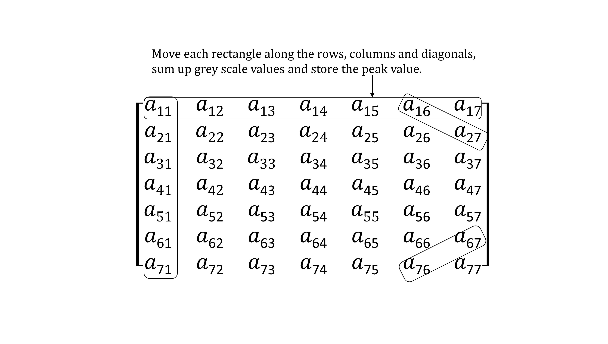

# Weight Quantized DNN on IoT Devices

Workflow, methods used in this repository will be published as an IEEE GCCE2018 conference paper, citation will be updated later.

## Introduction:

Storing the weights in the flash then **read and compute piece by piece is extremely low-efficient**. As we know the processor inside hifive1 is quite powerful while, however, 16KB of RAM makes DNNs on this device not so feasible.

Our purpose is to **reduce the weights size greatly without affecting the accuracy.**

How this is possible? The answer is **logarithmic Quantization**. 

Say the original weights are 32bit float numbers, after quantization they are reduced to 3bit. in our case, we reduced the weights size of one hidden layer of MNIST from 50KB+ to 1KB- which make it possible to store whole matrices in the tiny RAM. 

## An algorithm for inputs reduction

## Quantization: Before & After

Quantization in 3bits: how weights look like?
-----------------------

   

## Accuracy:

