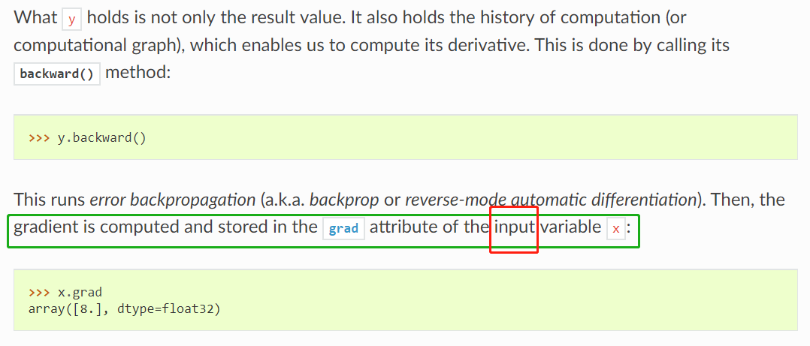

Compare two pieces of codes below:


```python
z = 2*x
y = x**2 - z + 1
y.backward(retain_grad=True)
z.grad
```

which gives:

array([-1.], dtype=float32


and 

```python
z = x**2
y = x**2 - z + 1
y.backward(retain_grad=True)
z.grad
```

which also gives:

array([-1.], dtype=float32

**keep the following in mind:**


