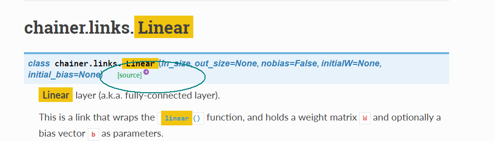

# Initializing a Neural Network

We will go through an official example to **dive into Chainer source code.**

Please note that simple operations are better explained at Chainer official guides, my goal here is **mastering the underlying usage** which could be helpful to scientific research. 

The example used here is the MNIST : https://github.com/chainer/chainer/tree/master/examples/mnist

When we search items from official documents, there are links which point to source code on Ghdtyithub.



Simple Procedures:

### Network Definition

### Set up a neural network to train

###  Set up an optimizer 

### Load the MNIST dataset

### Set up the trainer

### Run the training

These steps would be explained clearly.

Now let's see  how network is defined in the mnist example:

```python
class MLP(chainer.Chain):

    def __init__(self, n_units, n_out):
        super(MLP, self).__init__()
        with self.init_scope():
            # the size of the inputs to each layer will be inferred
            self.l1 = L.Linear(None, n_units)  # n_in -> n_units
            self.l2 = L.Linear(None, n_units)  # n_units -> n_units
            self.l3 = L.Linear(None, n_out)  # n_units -> n_out

    def __call__(self, x):
        h1 = F.relu(self.l1(x))
        h2 = F.relu(self.l2(h1))
        return self.l3(h2)
```

<u>MLP</u> in train_minist.py first take parameters from command line when you run the train_mnist program and then form the specific training neural network.

### How to initialize a NN? 

We use Chainer.links.Linear(params) to write neural networks.

A **Linear** link represents a mathematical function:

f(x)=Wx+b  

where W: weights and b: bias

```python
l1 = Chainer.links.Linear(784,1000)   # l1 simply means layer one
```


The above code will return us an object that represent a layer of 784 inputs to 1000 neurons.

By default, W is initialized randomly(i.i.d Guassian samples) and b is initialized with zeros.

now lets write a simple example:

```python
import numpy as np
import chainer as Chainer

print(l1.W)
```

Running this piece of code will give us

```python
>>>cjy@ubuntu:~/test$ python Chainer_doc1.py 
variable W([[ 1.0811805   1.0691578   0.41936523]
            [-0.6695963   0.28342    -0.03150013]
            [ 0.00741344 -0.2745356   0.7458864 ]
            [ 0.35346574 -0.6286263  -0.5337014 ]
            [ 0.2024522  -0.2374268   0.7790661 ]])
```


That's right, **a 3 × 5 array**.


Take a break and we will look into the Linear() function.

Inside Linear function:

```python
 def __init__(self, in_size, out_size=None, nobias=False,
                 initialW=None, initial_bias=None):
			   ...
        with self.init_scope():
            W_initializer = initializers._get_initializer(initialW)
            self.W = variable.Parameter(W_initializer)	   # Parameter() method of variable is called
            if in_size is not None:
                self._initialize_params(in_size)
                ...
```

well, we want to know how these are connected, we jump into Parameter()

####  variable: Array with a structure to keep track of computation. 

#### Parameter: a subclass of variable and it could be registered to Link 

    When a link that the parameter has been registered to is passed to an
    :class:`~chainer.GradientMethod`, an update rule is set to the parameter.
    This update rule specifies how to update the data array of the parameter
    using its gradient array.